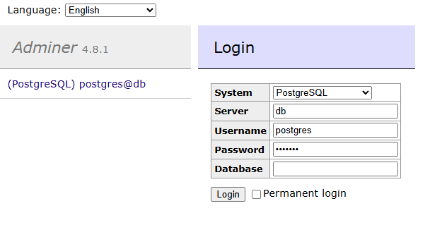

## Database Schemas Recreation

- Clone repository on your machine
- Create a container group being in project's root directory  
```
docker-compose up
```
- Create a database "Flatpol". Open adminer
```
localhost:8080
```
Log in with "postgres" as a username, "example" as a password and choose "Postgresql" as shown in the picture below.

- Recreate the all schemas, views and procedures.
```
docker cp <path_to_backup_file> <container_name>:/tmp/backup.sql
```
```
docker exec -it <container_name> bash
```
```
psql -U postgres -d Flatpol -f /tmp/backup.sql
```

## Python terminal app
- Go to FlatpollApp directory and run
```
pip install geopy
pip install psycopg2
```
- After packages installation run
```
python3 main.py
```